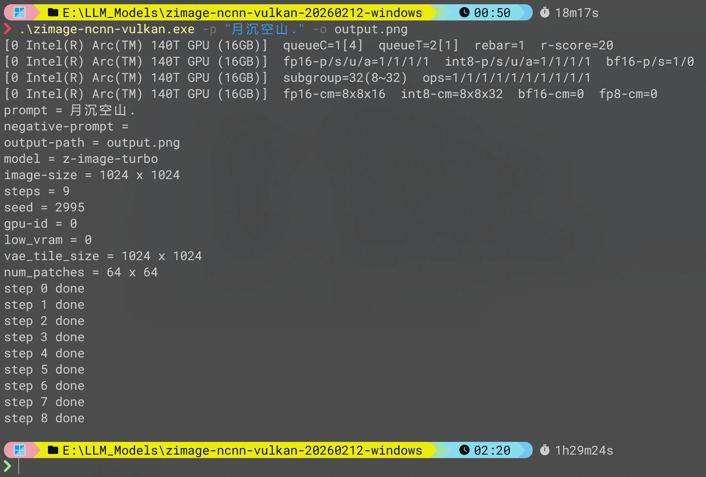

# Z\-Image ncnn Vulkan Test

注意到
**https://github.com/nihui/zimage-ncnn-vulkan/**
这份有趣的新工作，遂于闲暇时在本地测试。

### Base
- zimage-ncnn-vulkan uses [ncnn project](https://github.com/Tencent/ncnn) as the universal neural network inference framework.

### Requirements

- Minimum: 16GB RAM, any Vulkan integrated GPU
- Personal: Intel Arc 140T (27.4GB iGPU)

### Example Command

```shell
zimage-ncnn-vulkan.exe -p "月沉空山" -o output.png
```

### Result



### Conclusion
- 可见效果并不如人意，且推理速度令人大跌眼镜，仍有较大的优化空间。
